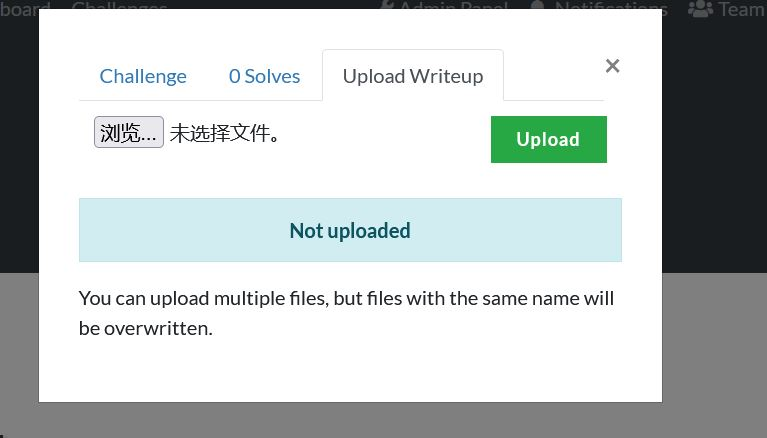
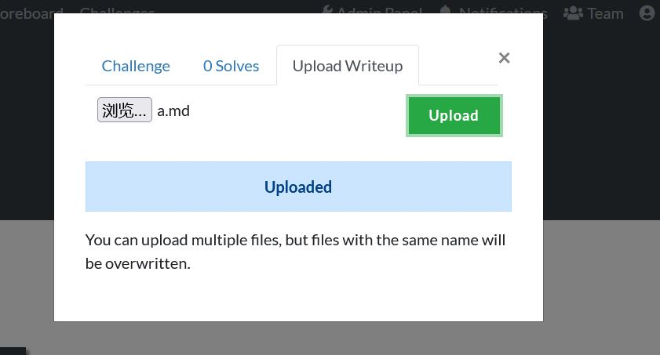

# Dynamic Value Challenges for CTFd with Writeup

A CTFd plugins Modified from [Dynamic Value Challenges for CTFd](https://github.com/CTFd/CTFd/blob/master/CTFd/plugins/dynamic_challenges/README.md),which allow players upload their writeups.

Other features are some with [Dynamic Value Challenges for CTFd](https://github.com/CTFd/CTFd/blob/master/CTFd/plugins/dynamic_challenges/README.md)

Support both user mode and team mode.

You can find uploaded writeups in /writeup/challenge_name/username_or_teamname/

## Installation

* Clone this repository to `CTFd/plugins`.Make sure the folder's name is `dynamic_challenges_wp`.

* Choose type `wp_dynamic` when you create a new challenge.

* I changed the structure of tables in database.That means you need to clone a new CTFd or use sqlite tools to drop `writeup` table and `writeup_dynamic_challenge` table manually if you hava used older version of this plugin.Resetting CTFd won't work since it doesn't drop table.
