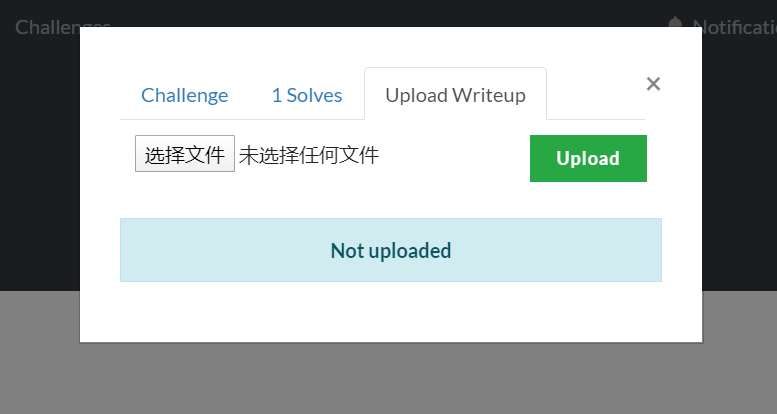
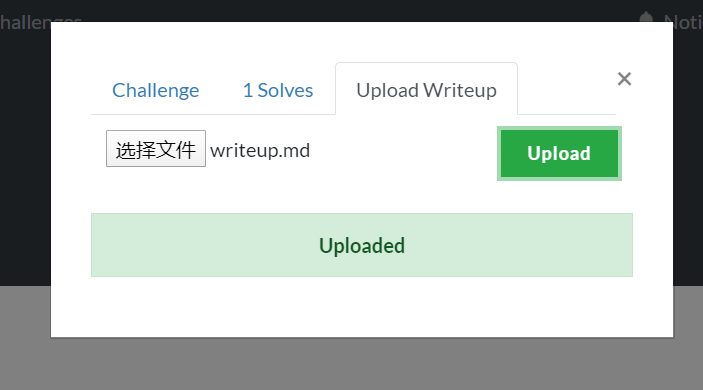

# Dynamic Value Challenges for CTFd with Writeup
A CTFd plugins Modified from [Dynamic Value Challenges for CTFd](https://github.com/CTFd/CTFd/blob/master/CTFd/plugins/dynamic_challenges/README.md),which allow players upload their writeups.

Other features are some with [Dynamic Value Challenges for CTFd](https://github.com/CTFd/CTFd/blob/master/CTFd/plugins/dynamic_challenges/README.md)

You can find uploaded writeups in /writeup

## Installation
* Clone this repository to `CTFd/plugins`.Make sure the folder's name is `dynamic_challenges_wp`.
* Choose type `wp_dynamic` when you create a new challenge.
